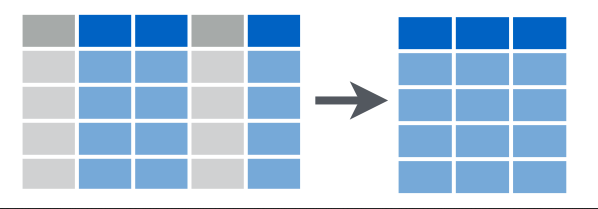
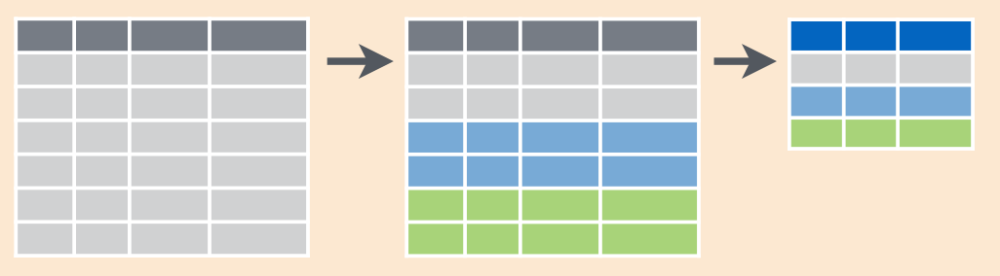

# Трансформация данных с `dplyr` и `tidyr`

Загрузим библиотеку:

```{r, message=FALSE}
library(tidyverse)
```

## Данные

### Датасет с опечатками

Этот датасет получен после обработки данных из статьи [The Gyllenhaal Experiment](https://pudding.cool/2019/02/gyllenhaal/) Расселла Голденберга и Мэта Даниэлса для [pudding](https://pudding.cool). Они анализировали опечатки, которые делают пользователи, когда ищут информацию про знаменитостей.

```{r}
misspellings <- read_csv("https://raw.githubusercontent.com/agricolamz/2020_HSE_ds4l_NN/master/data/misspelling_dataset.csv")
```
  

```{r}
misspellings
```

В датасете следующие колонки:

* `correct` --- правильное написание
* `spelling` --- написание пользователей
* `count` --- количество написаний (из колонки `spelling`) в датасете

### `diamonds`

`diamonds` --- это датасет встроенный в пакет `tidyverse`.

```{r}
diamonds
?diamonds
```

## `dplyr`

[Здесь](https://www.rstudio.com/wp-content/uploads/2015/02/data-wrangling-cheatsheet.pdf) и [здесь](https://github.com/rstudio/cheatsheets/raw/master/data-transformation.pdf) находятся щпаргалки про `dplyr`.

### `filter()`


Эта функция фильтрует строчки согласно некоторому условию.

Какие произнесения были использованы меньше чем 10 ползователями?

```{r}
misspellings %>%
  filter(count < 10)
```

`%>%` --- это **конвеера** (по-русски, еще называют *пайпом* или шуточно *велосипедом*). Горячая клавиши для вызова конвеера `Ctrl Shift M`. Конвеер позволяет создавать цепочки операций, так что результат работы одной функции становится инпутом для работы следующей функции. Сравните:

```{r}
sort(sqrt(abs(sin(1:22))), decreasing = TRUE)
1:22 %>% 
  sin() %>% 
  abs() %>% 
  sqrt() %>% 
  sort(decreasing = TRUE)
```

Конвееры широко используются внутри `tidyverse` и могут не всегда работать вне пакетов экосистемы:

Так что функция `filter()` вовзращает строчки, подходящие некоторому условию:

```{r}
misspellings %>%
  filter(count < 10)
```

Можно использовать несколько условий. Какие произнесения `Deschanel` было использовано меньше чем 10 ползователями?

```{r}
misspellings %>%
  filter(count < 10,
         correct == "deschanel")
```

Кроме того в этой функции можно использовать условие с ИЛИ. Какие произнесения были использовано меньше чем 10 ИЛИ более чем 500 пользователями? 

```{r}
misspellings %>%
  filter(count < 10 |
           count > 500)
```

### `slice()`

Эта функция фильтрует строчки на основе их индекса.


```{r}
misspellings %>%
  slice(3:7)
```

### `select()`

Эта функция выбирает переменные в датафрейме на основе их имени или индекса.



```{r}
diamonds %>%
  select(8:10)

diamonds %>%
  select(color:price)

diamonds %>%
  select(-carat)

diamonds %>%
  select(-c(carat, cut, x, y, z))

diamonds %>%
  select(cut, depth, price)
```

### `arrange()`

Эта функция сортирует строчки в датафрейме (числа --- по возрастанию/убыванию, строки --- по алфавиту).

```{r}
misspellings %>%
  arrange(count)

diamonds %>%
  arrange(desc(carat), price)

diamonds %>%
  arrange(-carat, price)
```

### `distinct()`

Эта функция возвращает уникальные строчки из датафрейма.

```{r}
misspellings %>%
  distinct(correct)

misspellings %>%
  distinct(spelling)

diamonds %>%
  distinct(color, cut)
```

```{block, type = "rmdtask"}
Отфильтруйте во встроенном датасете `starwars` героев, которые выше 180, имеют массу меньше 80. Сколько уникальных планет происхождения этих героев (переменная `homeworld`)?
```

```{r, results='asis', echo = FALSE}
starwars %>% 
  filter(height > 180, mass < 80) %>% 
  distinct(homeworld) %>% 
  nrow() %>% 
  checkdown::check_question()
```


### `mutate()`

Эта функция создает новые переменные.


```{r}
misspellings %>%
  mutate(misspelling_length = nchar(spelling),
         id = 1:n())
```

```{block2, type = "rmdtask"}
Создайте переменную с [индексом массы тела](https://en.wikipedia.org/wiki/Body_mass_index):  $\frac{mass}{height^2}$ для всех героев из датасета `starwars`. Сколько героев страдают ожирением(имеют индекс массы тела больше 30)? (Не забудьте перевести высоту из сантиметров в метры).
```

```{r, results='asis', echo = FALSE}
starwars %>% 
  mutate(height = height/100,
         BMI = mass/(height^2)) %>% 
  select(name, height, mass, BMI) %>% 
  filter(BMI >= 20) %>% 
  nrow() %>% 
  checkdown::check_question()
```

### `group_by(...) %>% summarise(...)`

Эти функции позволяют сгруппировать переменные по какой-то переменной в одном из столбцов датафрейма и получить какое обобщение (например, максимум, минимум, последнее значение, среднее, медиану и др.)


  
```{r}
misspellings %>%
  summarise(min(count), mean(count))

misspellings %>%
  group_by(correct) %>% 
  summarise(mean(count))

misspellings %>%
  group_by(correct) %>% 
  summarise(my_mean = mean(count))
```

Если нужно посчитать количество наблюдений в группе, используйте функцию `n()` внутри `summarise()` или функцию `count()`:

```{r}
misspellings %>%
  group_by(correct) %>% 
  summarise(n = n())

misspellings %>%
  count(correct)
```

Результат можно отсортировать, используя аргумент `sort`:

```{r}
misspellings %>%
  count(correct, sort = TRUE)
```

Бывают случаи, когда не хочется иметь отдельное саммари, а хочется добавить полученную информацию в новую колонку, для этого можно вместо `summarise()` использовать `mutate()`

```{r}
misspellings %>%
  group_by(correct) %>% 
  mutate(my_mean = mean(count))
```

Вот схема:


```{block, type = "rmdtask"}
В датасете `starwars` создайте переменную, содержащую среднее значение роста (`height`) для каждого вида (`species`).
```

```{r, include=FALSE}
starwars %>% 
  group_by(species) %>% 
  mutate(mean_height = mean(height, na.rm = TRUE))
```

## Объединение датафреймов

### `bind_...`

Это семейство фукнций, который позволяет объединять датасеты:

```{r}
my_tbl <- tibble(a  = c(1, 5, 2), 
                 b = c("e", "g", "s"))
```

Здесь датасеты объеденены по строчкам:
```{r}
my_tbl %>% 
  bind_rows(my_tbl)
```

Если какой-то из колонок не хватает, то нехватающие значения будут заполнены `NA`:

```{r}
my_tbl %>% 
  bind_rows(my_tbl[,-1])
```

Вот так можно соединить датафреймы по колонкам:

```{r}
my_tbl %>% 
  bind_cols(my_tbl)
```

Если количество строчек будет разным функция вернет ошибку:
```{r error = TRUE}
my_tbl %>% 
  bind_cols(my_tbl[-1,])
```

### `.._join()`

Данное семейство функций позволяет объединять датафреймы на основании некоторой общей колонки или набора общих колонок.

```{r}
languages <- tibble(
  languages = c("Selkup", "French", "Chukchi", "Polish"),
  countries = c("Russia", "France", "Russia", "Poland"),
  iso = c("sel", "fra", "ckt", "pol")
  )
languages
country_population <- tibble(
  countries = c("Russia", "Poland", "Finland"),
  population_mln = c(143, 38, 5))
country_population
inner_join(languages, country_population)
left_join(languages, country_population)
right_join(languages, country_population)
anti_join(languages, country_population)
anti_join(country_population, languages)
full_join(country_population, languages)
```


## Пакет `tidyr`

Перед нами датасет с количеством носителей некоторых языков Индии according the census 2001 (data from Wikipedia):

```{r}
langs_in_india_short <- read_csv("https://raw.githubusercontent.com/agricolamz/2020.02_Naumburg_R/master/data/languages_in_india.csv")
```

* Широкий формат

```{r}
langs_in_india_short
```

* Длинный формат

```{r, echo = FALSE}
langs_in_india_short %>% 
  pivot_longer(names_to = "type", values_to = "n_speakers", n_L1_sp:n_all_sp)->
  langs_in_india_long
langs_in_india_long
```

* Широкий формат → длинный формат: `tidyr::pivot_longer()`


```{r}
langs_in_india_short %>% 
  pivot_longer(names_to = "type", values_to = "n_speakers", n_L1_sp:n_all_sp)->
  langs_in_india_long

langs_in_india_long
```

* Длинный формат → шиирокий формат: `tidyr::pivot_wider()`


```{r}
langs_in_india_long %>% 
  pivot_wider(names_from = "type", values_from = "n_speakers")->
  langs_in_india_short
langs_in_india_short
```

### Концепция *tidy data*

Одни и те же данные можно представить разными способами. Основная философия `tidyverse` построена вокруг понятия *tidy data*:

* Каждая переменная содержится в отдельном столбце.
* Каждое наблюдение содержится в отдельной строчке.
* Каждое значение записано в свою ячейку.

```{block, type = "rmdtask"}
[Здесь](https://github.com/agricolamz/2020_HSE_ds4l_NN/raw/master/data/daghestan_census.xlsx) находятся данные содержащие информацию о деревнях в Дагестане в формате `.xlsx`. Данные разделены на разные листы и содержат разные переменные (данные полученные из разных источников, так что у них переменных есть префикс `_s1` -- первый источник; и `_s2` -- второй источник):

* `id_s1` -- (s1) id из первого источника;
* `name_1885` -- (s1) название деревни по переписи 1885
* `census_1885` -- (s1) количество людей по переписи 1885
* `name_1895` -- (s1) название деревни по переписи 1895
* `census_1895` -- (s1) количество людей по переписи 1895
* `name_1926` -- (s1) название деревни по переписи 1926
* `census_1926` -- (s1) количество людей по переписи 1926
* `name_2010` -- (s1) название деревни по переписи 2010
* `census_2010` -- (s1) количество людей по переписи2010
* `language_s1` -- (s1) язык, на котором говорят в деревне согласно первому источнику
* `name_s2` -- (s2) название деревни согласно второму источнику
* `language_s2` -- (s2) язык, на котором говорят в деревне согласно второму источнику
* `Lat` -- (s2) широта
* `Lon` -- (s2) долгота
* `elevation` -- (s2) высота

Соедините все эти разные таблицы из `.xlsx`:
```

```{r,  echo=FALSE, message=FALSE}
s1 <- readxl::read_xlsx("data/daghestan_census.xlsx", 1)
s2 <- readxl::read_xlsx("data/daghestan_census.xlsx", 2)
s3 <- readxl::read_xlsx("data/daghestan_census.xlsx", 3)
s4 <- readxl::read_xlsx("data/daghestan_census.xlsx", 4)
s5 <- readxl::read_xlsx("data/daghestan_census.xlsx", 5)
s6 <- readxl::read_xlsx("data/daghestan_census.xlsx", 6)

s1 %>% 
  left_join(s2) %>%
  left_join(s3) %>% 
  left_join(s4) %>% 
  left_join(s6) %>% 
  left_join(s5) %>% 
  distinct() ->
  merged
head(merged)
```

```{block, type = "rmdtask"}
Посчитайте сколько раз языки совпадают в двух источниках (переменные `language_s1` и `language_s2`).
```

```{r, results='asis', echo = FALSE}
merged %>% 
  count(language_s1 == language_s2) %>% 
  slice(2) %>% 
  select(n) %>% 
  unlist() %>% 
  checkdown::check_question()
```

```{block, type = "rmdtask"}
Посчитайте среднюю высоту для языков из первого источника, какой выше?
```

```{r, results='asis', echo = FALSE, message = FALSE}
merged %>% 
  group_by(language_s1) %>% 
  summarise(m_el = mean(elevation)) %>% 
  arrange(-m_el) %>% 
  head(1) %>% 
  select(m_el) %>% 
  unlist() %>% 
  checkdown::check_question()
```

```{block, type = "rmdtask"}
Посчитайте количество носителей разных языков (согласно второму источнику) для каждой переписи. Покажите значение для лакского языка:
```

```{r,  echo=FALSE, message=FALSE}
merged %>% 
  group_by(language_s2) %>%  
  summarise(s_1885 <- sum(census_1885),
            s_1895 <- sum(census_1895),
            s_1926 <- sum(census_1926),
            s_2010 <- sum(census_2010)) %>% 
  filter(language_s2 == "Lak")
```
