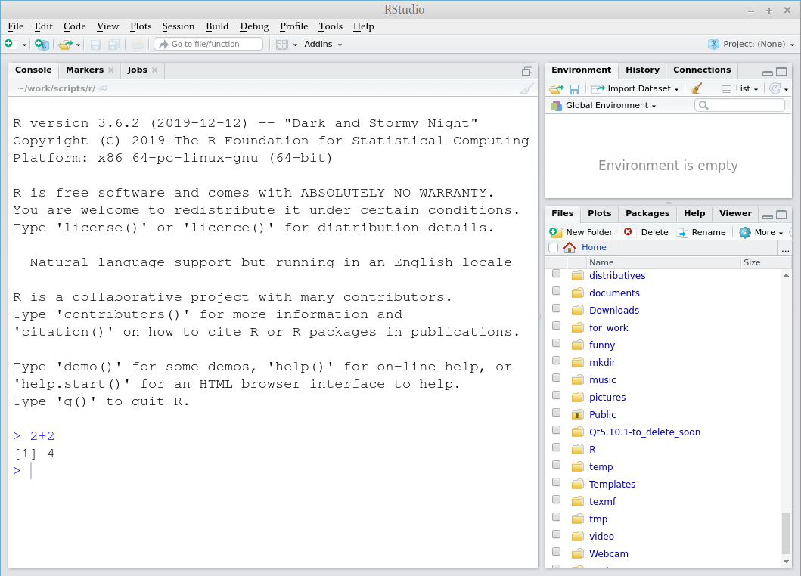

--- 
title: "Основы анализа данных"
author: "Г. Мороз"
date: "2020-2021"
bibliography:
- bibliography.bib
editor_options:
  chunk_output_type: console
link-citations: yes
documentclass: book
site: bookdown::bookdown_site
biblio-style: apalike
---

# Требования

Чтобы работать в классе, необходимо установить следующие программы:

* **R** можно найти здесь: <https://cloud.r-project.org/>;
* **RStudio** можно найти здесь: <https://rstudio.com/products/rstudio/download/#download> (бесплатную версию!);
* после установки откройте RStudio и наберите 2+2.

Если Вы видите что-то такое, значит все хорошо.

* Пройдите на сайт <https://rstudio.cloud/> и зарегестрируйтесь. Это опционально, но если у Вас что-то не будет работать на Вашем компьютере, можно воспользоваться этой опцией.

* Можно не посещать занятия и не делать домашние задания если Вы пройдете следующие онлайн курсы:
    * [Introduction to R](https://learn.datacamp.com/courses/free-introduction-to-r)
    * [Data Manipulation with dplyr](https://learn.datacamp.com/courses/data-manipulation-with-dplyr)
    * [Introduction to Data Visualization with ggplot2](https://learn.datacamp.com/courses/introduction-to-data-visualization-with-ggplot2)
    
Если Вы хотите пройти какие-то другие курсы на [datacamp](https://learn.datacamp.com/courses) (не обязательно связанные с R), можете написать мне, я добавлю Вас в группу, которая позовляет проходить курсы бесплатно.

## Домашние работы

* [домашняя работа 1](https://docs.google.com/forms/d/e/1FAIpQLSeRgoo6G0CALGmYjYI1ZayJ7jpTp2k1vmwRey7Qs5hyNYMC8Q/viewform)
* домашняя работа 2
* домашняя работа 3